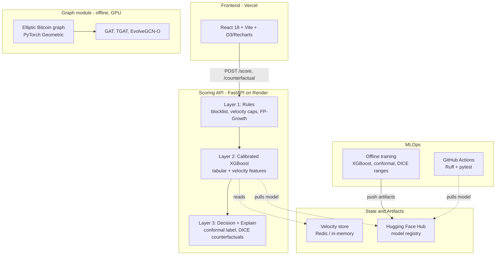

# Fraud Detection Platform

> An end-to-end, **deployed** fraud-detection platform on free-tier infra — model registry → CI → deploy — pairing a real-time tabular scoring API with a graph-neural-network benchmark on real Bitcoin fraud data.

[](https://github.com/shiva-shivanibokka/Fraud-Detection-System/actions/workflows/ci.yml)


---

## Recruiter TL;DR

- **What it is:** A fraud-detection platform with two complementary parts — a **production, deployed real-time scoring API** (FastAPI + calibrated XGBoost, with conformal uncertainty and counterfactual explanations) and a **graph-neural-network module** that benchmarks static vs. temporal GNNs on the real **Elliptic Bitcoin** fraud graph.
- **Hardest problem solved:** Finding a **label leak I had written myself**. The tabular model reported AUC-ROC 0.997 — implausible for fraud. The entity synthesizer was assigning devices and IPs *using the label*, so the graph features fed the answer back to the model. Fixing it cut AUC-PR from 0.906 to **0.314** and dollar-capture from 0.93 to **0.182**. The honest number is the one below. ([full write-up](#the-0997-that-wasnt-a-leak-in-the-entity-synthesizer))
- **Also:** an end-to-end MLOps loop on free-tier infra — model registry (Hugging Face Hub) → CI (GitHub Actions) → deploy (Render + Vercel) — and rigorous A/B-testing of model complexity (ensembles, GNNs) instead of assuming fancier is better.
- **Real numbers:** Tabular model **AUC-PR 0.314** at a 0.49% base rate (~64× lift) on *synthetic* Sparkov data; GNN module — **EvolveGCN-O beats static GAT and TGAT on illicit-F1** on the **real** Elliptic Bitcoin graph.
- **Data provenance:** the tabular module runs on the Kaggle **Sparkov generator** (not real payments); only the Elliptic GNN module uses real-world fraud data. Metrics are labelled accordingly throughout.

---

## Overview

Fraud is two different problems at once, so this platform has two modules:

1. **Real-time transaction scoring (deployed).** A 3-layer decision engine — hard rules → calibrated ML → explainable decision — that scores a transaction in ~10 ms and returns not just a score but a *calibrated probability*, a *conformal confidence label*, and *what-if counterfactuals*. This is the always-on, low-latency path.

2. **Graph-based fraud research (offline, GPU).** Fraud is also a network: illicit money moves through transaction graphs. This module trains and rigorously compares **GAT**, **TGAT**, and **EvolveGCN-O** on the real **Elliptic Bitcoin** dataset to study when temporal graph modeling actually helps.

The guiding principle throughout is **earn the complexity**: every "fancier" option (ensembles, temporal GNNs) is A/B-tested against a simpler baseline and only kept if it measurably wins.

**Live frontend:** https://fraud-detection-system-ebon.vercel.app

---

## Features

### Module 1 — Real-time scoring API (deployed)
- **3-layer decision engine:** (1) hard rules — blocklist, velocity caps, FP-Growth pattern rules; (2) calibrated XGBoost on tabular + velocity features; (3) decision + explanations.
- **Calibrated probabilities** — isotonic-calibrated XGBoost, so a 0.83 score means ~83% fraud likelihood, not an arbitrary number.
- **Conformal uncertainty (MAPIE):** every score carries a `confidence_label` (`confident_fraud` / `confident_legit` / `uncertain`) with a **90% coverage guarantee**; ~10% of transactions are flagged "uncertain → human review." The conformal threshold is computed offline and applied with plain arithmetic, so the library isn't a serving dependency.
- **Counterfactual explanations (DICE):** a `/counterfactual` endpoint returns the minimal change to actionable fields (amount, distance, hour) that would flip the decision — *"if amount were \$139 and distance 19 km, this approves."*
- **Velocity feature store:** Redis sliding-window counts/sums per card/device/IP/merchant (1 min → 24 hr), with an in-memory fallback and dual-mode local/Upstash config.
- **DuckDB feature engine:** the offline velocity computation has a DuckDB implementation that is **~9× faster than the pandas version and verified identical to 1e-12**.
- **Model registry:** artifacts are pulled from **Hugging Face Hub** at build/startup (idempotent), keeping binaries out of git.
- **LLM analyst copilot (BYOK):** provider- and model-selectable (OpenAI / Groq) with the user's own key held only in the browser and relayed per-request — never stored server-side. Three tools: a copilot grounded on the system's own fraud knowledge (rules, rings, metrics, importances), a natural-language → structured-rule editor, and one-click fraud-ring case reports.
- **Live transaction feed:** each decision is best-effort published to **Supabase Realtime** (fire-and-forget, so `/score` latency is unaffected) and streamed into a dashboard tab where declines glow red.
- **Analyst feedback loop:** ✓/✗ labels on decisions persist to a JSONL sink (and Supabase when configured) and feed a scheduled **retrain trigger** that signals when enough new labels have accrued.
- **Observability (optional):** Sentry error tracking (FastAPI + React) and DagsHub/MLflow remote experiment tracking, each gated on a single env var.

### Module 2 — Graph-neural-network research (offline)
- Loads the **Elliptic Bitcoin** dataset via PyTorch Geometric: **203,769 transaction nodes, 234,355 edges, 165 features, 49 time-steps**.
- Three models on a strict temporal split (train early steps, test late steps): **GAT** (static), **TGAT** (continuous-time edge-attention), **EvolveGCN-O** (snapshot-based, evolves GCN weights via GRU).
- Reports both **best-epoch** and **rigorous validation-based early-stopping** numbers — no cherry-picking.
- Trained on a local **NVIDIA RTX 4060** (CUDA).

---

## Architecture



**Why this shape?**
- **3 layers, not 1 model:** rules catch the obvious/known fraud in <1 ms and protect the ML layer; the ML layer handles the gray zone; the explanation layer makes decisions auditable. This is the standard production pattern.
- **Model registry instead of git-tracked binaries:** keeps the repo lean and lets the deployed service pull the exact model version at build time — the artifact is decoupled from the code.
- **Conformal/DICE computed to be serving-light:** the heavy libraries run *offline*; serving only needs a threshold and a small ranges file, so the deployed image stays inside free-tier RAM.
- **GNN module kept offline:** graph training needs the full graph + GPU; it's a research/benchmark module, deliberately separate from the low-latency serving path.

The full reasoning behind these and other choices (ensemble rejection, temporal-GNN selection, BYOK LLM relay, fire-and-forget live feed) is recorded in [`docs/ADR.md`](docs/ADR.md).

---

## Engineering Decisions & Findings

The theme of this project is **earn the complexity**: every "more sophisticated" option was A/B-tested against a simpler baseline on the *same* production metrics and kept only if it measurably won. Two of those experiments are worth calling out because the result was counter-intuitive — the fancier model lost.

### Ensembling made the model *worse*, not better

The obvious next move after a strong single XGBoost is to ensemble it with a second gradient booster. It didn't pan out across the configurations tried:

> **Stale absolutes, intact conclusion.** These experiments predate the
> [leakage fix](#the-0997-that-wasnt-a-leak-in-the-entity-synthesizer), so the
> AUC-PR values quoted here come from the leaked baseline. Both members were
> inflated by the same leak, so the *relative* finding — the ensemble lost to the
> calibrated single XGBoost — still stands. Re-running the A/B on the corrected
> data is open work.

- **XGBoost + LightGBM (soft vote).** The LightGBM member was simply weaker (~**0.874** vs **0.906** AUC-PR, both pre-fix). Averaging two probabilities only helps when the members are *comparably strong* and make *different* errors; here the weaker member dragged the blended score **below** the single-model baseline.
- **XGBoost + CatBoost (soft vote, Optuna-tuned).** CatBoost is a genuine peer of XGBoost, so this had a real shot. The CatBoost member was HPO-tuned for AUC-PR, soft-voted, isotonic-calibrated on a prefit holdout, and evaluated against the current baseline on the *same* production metrics (AUC-PR, precision@k, dollar-capture). It **still didn't beat** the calibrated single XGBoost.

**Decision:** ship the simpler, calibrated single XGBoost. The ensemble code (`src/model/train_ensemble.py`) stays in the repo as **evidence of the experiment**, not as the production model. **Lesson:** a soft-vote ensemble is only as useful as its weakest member is strong — model complexity that doesn't add *error diversity* buys nothing but latency and risk.

### With temporal GNNs, the right inductive bias beat the fancier model

On the Elliptic graph, the real question wasn't "static vs. temporal" but "*which* temporal structure fits the data":

- **TGAT** (continuous-time edge-gap attention) is the more elaborate model — yet it didn't beat even the **static GAT** on illicit-F1 (0.314 vs. 0.447, best-epoch).
- **EvolveGCN-O** (evolves the GCN weights across time-step snapshots via a GRU) was the right fit, leading on illicit-F1 under *both* the best-epoch and the stricter validation-based early-stopping protocol.

**Lesson:** matching the model's inductive bias to the data's actual structure (here, snapshot-to-snapshot weight drift) mattered more than reaching for the most complex temporal mechanism. Full numbers in [Results](#results).

### Two more "keep it honest, keep it light" calls

- **Calibrated + conformal, but serving-light.** The model is isotonic-calibrated (so 0.83 means ~83% fraud likelihood) and MAPIE conformal adds a 90%-coverage `uncertain` band — but both heavy libraries run **offline**. Serving applies a single exported threshold with plain arithmetic, so the deployed image stays inside free-tier RAM.
- **One velocity computation, two call sites.** The sliding-window velocity features run the *exact same code* offline (training) and online (serving), eliminating train/serve skew — the most common silent cause of a model that looks great in evaluation and underperforms in production.

---

## Tech Stack

| Area | Choice | Why |
|---|---|---|
| API | **FastAPI + Uvicorn** | async, typed request/response models, fast |
| Model | **XGBoost** + scikit-learn isotonic calibration | the standard strong choice for tabular fraud; calibration makes scores meaningful |
| Uncertainty | **MAPIE** (conformal) | coverage-guaranteed confidence, applied threshold-only at serving |
| Explainability | **dice-ml** | counterfactual "what-if" explanations |
| Feature engine | **DuckDB** (+ pandas reference) | ~9× faster velocity computation, verified identical |
| Cache | **Redis** (dual-mode local/Upstash) | sliding-window velocity, in-memory fallback |
| Registry | **Hugging Face Hub** | versioned model artifacts pulled at deploy |
| Config | **pydantic-settings** | no hardcoded URLs/thresholds |
| LLM copilot | **OpenAI / Groq** over httpx (BYOK) | provider/model-selectable, key stays in the browser |
| Live feed | **Supabase Realtime** | streams scored decisions to the dashboard |
| Observability | **Sentry · DagsHub/MLflow** | error tracking + remote experiment tracking, env-gated |
| GNN | **PyTorch + PyTorch Geometric** | GAT / TGAT / EvolveGCN-O on Elliptic |
| Frontend | **React 18 + Vite + D3 + Recharts** | analyst dashboard |
| CI / Deploy | **GitHub Actions · Render · Vercel** | Ruff + pytest gate; backend + frontend hosting |

---

## Skills Demonstrated

- **Production ML deployment / MLOps** — model serving decoupled from training, model registry, build-time artifact pull
- **CI/CD pipeline implementation** — GitHub Actions running Ruff + pytest on every push
- **Cloud deployment** — Render (backend) + Vercel (frontend)
- **RESTful API design** — typed FastAPI endpoints with health/metrics observability
- **System design & architecture** — documented 3-layer tradeoff, serving-light conformal/DICE
- **Data engineering** — offline feature pipeline; DuckDB vs pandas equivalence + benchmark
- **Uncertainty quantification & explainability** — conformal prediction + counterfactuals
- **Graph & temporal deep learning** — GAT, TGAT, EvolveGCN-O on a real graph dataset
- **LLM application engineering** — provider abstraction, BYOK key handling, grounded retrieval, function-style structured outputs
- **Real-time & event-driven systems** — Supabase Realtime feed, fire-and-forget publish, active-learning feedback loop
- **Rigorous evaluation** — temporal splits, production metrics, honest A/B model selection

---

## Getting Started

```bash
# 1. Environment (Python 3.11)
conda create -n fraud-detection python=3.11 -y
conda activate fraud-detection

# 2a. Serving-only deps (lean — what the deployed API uses)
pip install -r requirements-api.txt
# 2b. OR full deps (training, ensembles, GNN)
pip install -r requirements.txt

# 3. Model artifacts: set HF_REPO_ID to pull them from Hugging Face Hub
#    (or place them in models/ yourself)
export HF_REPO_ID=shiva-1993/fraud-detection-model   # PowerShell: $env:HF_REPO_ID=...

# 4. Run the scoring API
uvicorn src.api.main:app --host 0.0.0.0 --port 8000
# health check:
curl http://localhost:8000/health

# 5. Run the analyst dashboard
cd frontend && npm install && npm run dev   # http://localhost:5173
```

Config is driven by `src/config.py` (pydantic-settings) — see `.env.example` for all variables. The API runs without Redis (in-memory velocity fallback) and without a model (deterministic demo mode).

---

## Usage

**Score a transaction**
```bash
curl -X POST http://localhost:8000/score -H "Content-Type: application/json" \
  -d '{"cc_num":"5555444433332222","amt":4800,"hour":3,"is_night":1,"geo_distance_km":1200}'
```
```jsonc
{
  "decision": "DECLINE",
  "fraud_score": 0.8314,
  "reasons": ["Unusually high transaction amount ($4800.00)", "Large geographic distance (1200 km from home)", ...],
  "confidence_label": "uncertain",      // conformal (90% coverage)
  "prediction_set": [],
  "conformal_coverage": 0.9,
  "latency_ms": 9.75
}
```

**Counterfactual (what would flip it?)**
```bash
curl -X POST http://localhost:8000/counterfactual -H "Content-Type: application/json" \
  -d '{"cc_num":"5555444433332222","amt":4800,"hour":3,"is_night":1,"geo_distance_km":1200}'
# -> minimal changes to amount/distance/hour that make the model predict legit
```

**Train / benchmark the graph models** (downloads Elliptic on first run)
```bash
python -m src.graph_fraud.explore_temporal      # dataset structure
python -m src.graph_fraud.train_gat             # static GAT baseline
python -m src.graph_fraud.train_evolvegcn       # temporal EvolveGCN-O
python -m src.graph_fraud.export_predictions    # write served predictions JSON
```
The export writes `models/elliptic_graph.json` (test metrics + per-time-step illicit counts + a sampled high-risk subgraph), which the API serves torch-free at `GET /graph/elliptic`.

---

## Project Structure

```
Fraud-Detection-System/
├── src/
│   ├── config.py                 # pydantic-settings config (no hardcoded values)
│   ├── download_models.py        # pull artifacts from Hugging Face Hub (idempotent)
│   ├── pipeline.py               # offline data → features → model pipeline
│   ├── api/main.py               # FastAPI decision engine + LLM/feedback/live-feed endpoints
│   ├── llm/                      # BYOK provider abstraction + copilot/case-report/rule prompts
│   ├── velocity/
│   │   ├── feature_store.py      # Redis sliding-window velocity (canonical)
│   │   └── velocity_duckdb.py    # DuckDB engine (~9× faster, verified identical)
│   ├── model/
│   │   ├── train.py              # calibrated XGBoost + production metrics
│   │   ├── train_ensemble.py     # ensemble A/B experiment (evaluated, not shipped)
│   │   ├── calibrate_conformal.py# MAPIE conformal threshold export
│   │   └── export_cf_ranges.py   # DICE feature ranges
│   ├── graph/                    # entity graph, fraud-ring detection, FP-Growth rules
│   └── graph_fraud/              # Elliptic GNN module: GAT, TGAT, EvolveGCN-O
├── frontend/                     # React 18 + Vite analyst dashboard
├── tests/                        # pytest suite (API + units)
├── scripts/
│   ├── upload_models_to_hf.py
│   └── retrain_from_feedback.py  # active-learning retrain trigger
├── supabase/migrations/          # Postgres + pgvector schema, feedback + live-feed tables
├── .github/workflows/
│   ├── ci.yml                    # Ruff + pytest
│   └── retrain-trigger.yml       # nightly feedback aggregation
├── render.yaml                   # backend deploy blueprint
├── requirements-api.txt          # lean serving deps
└── requirements.txt              # full training/research deps
```

---

## Testing

```bash
python -m pytest        # 12 tests: API integration + unit
ruff check src/ tests/  # lint
```
CI (`.github/workflows/ci.yml`) runs Ruff + pytest on every push to `main`, pulling the model from Hugging Face Hub so tests exercise the real artifacts. The test suite caught a real production bug during development (a `NaN` in rule data that 500'd the `/fraud-rules` endpoint).

---

## Deployment

| Component | Platform | Status |
|---|---|---|
| Frontend | **Vercel** | Live → https://fraud-detection-system-ebon.vercel.app |
| Backend API | **Render** (free tier) | Live (build pulls model from HF Hub; `render.yaml` blueprint) |
| Model registry | **Hugging Face Hub** | `shiva-1993/fraud-detection-model` |

A scheduled GitHub Action (`.github/workflows/keep-warm.yml`) pings `/health` to keep the free-tier backend warm. The backend ships a lean dependency set (`requirements-api.txt`) so it fits the 512 MB free-tier RAM.

### Deploy from scratch (reproduce the deployment)

End-to-end runbook to stand the whole platform up from zero. Env vars use bash syntax; on PowerShell use `$env:NAME = "value"`.

> **Already have artifacts on Hugging Face Hub?** Skip steps 1–2 — the Render build pulls the model from HF automatically, so redeploying the services is just steps 3–4.

**1. Train the models and build the serving artifacts** (writes everything to `models/`)
```bash
pip install -r requirements.txt            # full training/research deps
python src/pipeline.py                      # data → velocity → rules → calibrated XGBoost (+ ONNX, drift)
python -m src.model.calibrate_conformal     # conformal.json   (MAPIE threshold)
python -m src.model.export_cf_ranges        # cf_ranges.json   (DICE feature ranges)
python -m scripts.export_rings              # ring_stats.json
python -m scripts.export_entity_graph       # entity_graph.json
python -m scripts.export_encoders           # encoders.json
python -m src.graph_fraud.export_predictions # elliptic_graph.json (EvolveGCN-O; needs a GPU, auto-downloads Elliptic)
```

**2. Publish the artifacts to Hugging Face Hub**
```bash
export HF_REPO_ID="<your-username>/fraud-detection-model"
export HF_TOKEN="hf_..."                    # write-scoped token from hf.co/settings/tokens
python scripts/upload_models_to_hf.py        # uploads everything in models/
```

**3. Deploy the backend (Render)**
- New → **Blueprint** → point at your fork; Render reads `render.yaml` (build pulls the model from HF, starts Uvicorn, health-checks `/health`).
- Required env vars: `HF_REPO_ID` (your repo) and `CORS_ORIGINS` (JSON array including your Vercel URL, e.g. `["https://your-app.vercel.app"]`).
- Optional: `REDIS_URL` (persistent velocity), `SUPABASE_URL` / `SUPABASE_KEY` (feedback + live feed), `SENTRY_DSN` / `ENVIRONMENT` (error tracking).

**4. Deploy the frontend (Vercel)**
- Import your fork, set **Root Directory** to `frontend/` (build `npm run build`, output `dist/`).
- Required env var: `VITE_API_URL` = your Render backend URL.
- Optional: `VITE_SUPABASE_URL` / `VITE_SUPABASE_ANON_KEY` (enables the Live Feed tab), `VITE_SENTRY_DSN`.
- After Vercel gives you a URL, add it to the backend's `CORS_ORIGINS` and redeploy the backend.

**5. (Optional) Live feed + feedback — Supabase**
- Create a Supabase project; in the SQL editor run `supabase/migrations/001…004` **in order**.
- Migrations 003/004 disable row-level security so the API's anon key can insert feedback + live decisions.
- Set the `SUPABASE_*` vars on Render and the `VITE_SUPABASE_*` vars on Vercel (from step 3/4).

**6. (Optional) Keep the free backend warm**
- Edit `HEALTH_URL` in `.github/workflows/keep-warm.yml` to your Render URL. The scheduled job pings `/health` every 10 min; use **Run workflow** to warm it on demand before a demo.

> The **AI Assistant** needs no deploy config — it's bring-your-own-key: users paste their own LLM key in the app's Settings tab, relayed per-request and never stored server-side.

---

## Results

### Module 1 — tabular scoring (temporal eval, 2019 train / 2020 test)

> **These numbers were revised down after a leakage fix.** An earlier version of
> this table reported AUC-ROC 0.997 / AUC-PR 0.906 / dollar-capture 0.93. Those
> figures were produced by a label leak in the entity synthesizer, not by the
> model. The leak is fixed and the honest numbers are below. See
> [The 0.997 that wasn't](#the-0997-that-wasnt-a-leak-in-the-entity-synthesizer).

Source data is the Kaggle **Sparkov** set — *generator-produced, not real
payments* — subsampled to 30% (555,718 transactions; test fraud rate 0.49%).

| Metric | Value | Meaning |
|---|---|---|
| AUC-ROC | 0.950 | discrimination |
| **AUC-PR** | **0.314** | precision on severely imbalanced data — ~64× lift over the 0.49% base rate |
| Precision@1% | 0.236 | of the top-1% flagged, 24% are real fraud |
| Recall@0.1%FPR | 0.176 | fraud caught at a 1-in-1000 false-block rate |
| **Dollar-capture rate** | **0.182** | 18% of fraudulent dollar volume flagged |

AUC-PR 0.314 against a 0.49% base rate is a real model (~64× lift), and it is a
far less flattering number than the one it replaces. That is the point: the
previous table was measuring the synthesizer, not the classifier.

**Earned-complexity check:** soft-vote ensembles (XGBoost+LightGBM, then an
Optuna-tuned XGBoost+CatBoost) were A/B-tested against the calibrated single
XGBoost and **did not beat it**, so the simpler model was kept. That A/B was run
against the pre-fix baseline; the conclusion (simpler won) is unaffected by the
leak, but the absolute numbers quoted in that section are stale.

### The 0.997 that wasn't: a leak in the entity synthesizer

The raw Sparkov data has no device or IP fields, so `synthesize_entity_fields()`
invents them. It invented them **using the label**, in two deterministic ways:

```python
ring_devices = rng.choice(device_pool[: n_devices // 3], ...)   # fraud cards only
primary      = rng.choice(device_pool[n_devices // 3 :])        # legit cards only
card_to_prefix[card] = f"192.168.{...}"                         # fraud cards only
```

Fraud cards were confined to one slice of the device pool and handed a dedicated
`192.168.*` range while everyone else got `10.*`. The graph stage aggregates
those columns into `graph_device_fraud_rate` / `graph_ip_fraud_rate` and feeds
them to XGBoost — so the label reached the model through a synthetic feature it
had authored itself. The temporal split was correct and could not help: the leak
was baked into the features before the split ever happened.

Measured on a toy harness, fitting per-entity fraud rate on train and scoring
test (exactly what the graph features do):

| Signal | Before | After |
|---|---|---|
| `ip_prefix` → label (temporal AUC) | 0.982 | 0.625 |
| `ip_prefix` → label, rings disabled | — | 0.486 *(chance)* |
| card-level IP pool shared fraud↔legit | 0% *(disjoint)* | 100% |

**A second bug was hiding inside the first.** `legit_cards` was defined as every
card with a non-fraud transaction — which includes fraud cards, since they
transact legitimately too. The legit loop ran second and **overwrote** the ring
device assignments, so the fraud rings barely existed. GraphSAGE, ring detection
and FP-Growth were all working on structure that had been quietly erased, while
the IP leak carried the model to 0.997. Two bugs partly cancelling, with a
flattering number sitting on top.

The fix keeps rings real but makes their signal *earned*: one shared device pool,
only 25% of fraud cards in rings (most card fraud is one-off compromise, not
collusion), and no fraud-specific address space. `tests/test_data_prep_leakage.py`
fails if any of it regresses.

**Honest caveat that remains:** ring membership is still drawn using `is_fraud`,
because the generator has to decide who colludes. Device/IP therefore still
correlate with the label by construction, and graph-derived features here remain
optimistic relative to production, where entities are observed rather than
generated. `device_id` retains ~0.94 temporal AUC even with rings fully disabled
— that is card reputation (the same cards span the split), a legitimately
predictive production signal, not an artifact.

### Module 2 — Elliptic GNN (illicit class; test = late time-steps)

Reported under **two** protocols, transparently:

| Model | Illicit-F1 (best-epoch) | Illicit-F1 (val-based early stop) | AUC (best-epoch) |
|---|---|---|---|
| GAT (static) | 0.447 | 0.204 | 0.869 |
| TGAT (edge-time attention) | 0.314 | — | 0.853 |
| **EvolveGCN-O (temporal)** | **0.483** | **0.273** | 0.864 |

**Finding:** **EvolveGCN-O leads on illicit-F1 under both protocols.** The comparison shows *which* temporal inductive bias fits this graph: snapshot-based weight evolution (EvolveGCN) helps, while continuous-time edge-gap attention (TGAT) does not beat even the static GAT here. The gap between the two protocols reflects honest, validation-based model selection rather than reporting only the best epoch.

> Metrics were produced by the scripts in this repo (`src/model/train.py`, `src/graph_fraud/`) on the stated splits; they are reproducible, not hand-entered. The tabular table was regenerated end-to-end (`python src/pipeline.py --subsample 0.3 --force`) after the leakage fix — train 277,668 / test 278,050.
>
> **Deployed-artifact note:** the live `GET /graph/elliptic` endpoint (and the dashboard's GNN tab) serve the **EvolveGCN-O** export under validation-based early stopping (illicit-F1 ≈ 0.24, AUC ≈ 0.80 on the current export — exact figures vary slightly run-to-run on GPU). The best-epoch column above is an optimistic upper bound, reported alongside for transparency.

---

## Limitations & Known Tradeoffs

Stated plainly — a portfolio project is more credible when it's candid about its edges:

- **Free-tier cold starts.** The backend runs on Render's free tier, which sleeps after ~15 min idle, so the first request after a nap can take ~60s. A scheduled GitHub Action pings `/health` to keep it warm and the frontend shows a "waking up" banner with retries — but a cold first hit is still possible.
- **The GNN is a benchmark study, not a production detector.** The live `/graph/elliptic` serves EvolveGCN-O — the benchmark winner — under rigorous validation-based early stopping, but illicit-F1 is modest in absolute terms (~0.24) because the Elliptic illicit class is heavily imbalanced. Treat this module as an honest model comparison, not a deployable fraud detector.
- **No online retraining.** The analyst feedback loop logs ✓/✗ labels and a scheduled job flags when enough new labels have accrued, but retraining is still a manual, offline step — the model does not update itself in production.
- **Public endpoints are demo-grade.** The scoring API has no authentication or rate-limiting and runs single-region. Fine for a portfolio demo; not production-hardened.
- **Copilot retrieval is keyword-grounded.** The LLM assistant grounds on the system's own rules/rings/metrics via keyword retrieval, not embeddings — semantic pgvector RAG is deliberately deferred to keep heavyweight `torch` off the free-tier serving box (see Roadmap).

---

## Roadmap

- **pgvector semantic RAG** — upgrade the copilot's keyword-grounded retrieval to embeddings-backed pgvector retrieval (kept off the free-tier serving box today because sentence-transformers pulls torch)
- **Online retraining from the feedback loop** — today the analyst ✓/✗ labels are logged and a scheduled job flags when enough have accrued, but retraining is a manual, offline step; wiring the trigger to an automated retrain-and-promote pipeline is future work

---

## License

[MIT](LICENSE) © 2026 Shivani Bokka
