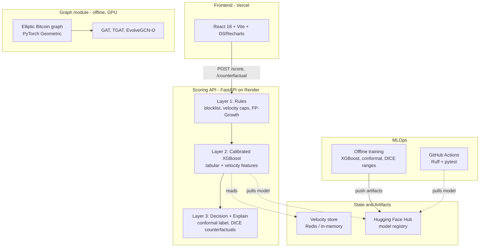

# Fraud Detection Platform

> Real-time tabular fraud scoring (deployed) **+** a graph-neural-network research module on real Bitcoin fraud data.

[](https://github.com/shiva-shivanibokka/Fraud-Detection-System/actions/workflows/ci.yml)


---

## Recruiter TL;DR

- **What it is:** A fraud-detection platform with two complementary parts — a **production, deployed real-time scoring API** (FastAPI + calibrated XGBoost, with conformal uncertainty and counterfactual explanations) and a **graph-neural-network module** that benchmarks static vs. temporal GNNs on the real **Elliptic Bitcoin** fraud graph.
- **Hardest problem solved:** Shipping an end-to-end MLOps loop on free-tier infra — model registry (Hugging Face Hub) → CI (GitHub Actions) → deploy (Render + Vercel) — *and* rigorously A/B-testing model complexity (ensembles, GNNs) instead of assuming fancier is better.
- **Real numbers:** Tabular model **AUC-PR 0.906**, **93% fraud-dollar capture** (temporal eval); GNN module — **EvolveGCN-O beats static GAT and TGAT on illicit-F1** on Elliptic.

---

## Overview

Fraud is two different problems at once, so this platform has two modules:

1. **Real-time transaction scoring (deployed).** A 3-layer decision engine — hard rules → calibrated ML → explainable decision — that scores a transaction in ~10 ms and returns not just a score but a *calibrated probability*, a *conformal confidence label*, and *what-if counterfactuals*. This is the always-on, low-latency path.

2. **Graph-based fraud research (offline, GPU).** Fraud is also a network: illicit money moves through transaction graphs. This module trains and rigorously compares **GAT**, **TGAT**, and **EvolveGCN-O** on the real **Elliptic Bitcoin** dataset to study when temporal graph modeling actually helps.

The guiding principle throughout is **earn the complexity**: every "fancier" option (ensembles, temporal GNNs) is A/B-tested against a simpler baseline and only kept if it measurably wins.

**Live frontend:** https://fraud-detection-system-ebon.vercel.app

---

## Features

### Module 1 — Real-time scoring API (deployed)
- **3-layer decision engine:** (1) hard rules — blocklist, velocity caps, FP-Growth pattern rules; (2) calibrated XGBoost on tabular + velocity features; (3) decision + explanations.
- **Calibrated probabilities** — isotonic-calibrated XGBoost, so a 0.83 score means ~83% fraud likelihood, not an arbitrary number.
- **Conformal uncertainty (MAPIE):** every score carries a `confidence_label` (`confident_fraud` / `confident_legit` / `uncertain`) with a **90% coverage guarantee**; ~10% of transactions are flagged "uncertain → human review." The conformal threshold is computed offline and applied with plain arithmetic, so the library isn't a serving dependency.
- **Counterfactual explanations (DICE):** a `/counterfactual` endpoint returns the minimal change to actionable fields (amount, distance, hour) that would flip the decision — *"if amount were \$139 and distance 19 km, this approves."*
- **Velocity feature store:** Redis sliding-window counts/sums per card/device/IP/merchant (1 min → 24 hr), with an in-memory fallback and dual-mode local/Upstash config.
- **DuckDB feature engine:** the offline velocity computation has a DuckDB implementation that is **~9× faster than the pandas version and verified identical to 1e-12**.
- **Model registry:** artifacts are pulled from **Hugging Face Hub** at build/startup (idempotent), keeping binaries out of git.
- **LLM analyst copilot (BYOK):** provider- and model-selectable (OpenAI / Groq) with the user's own key held only in the browser and relayed per-request — never stored server-side. Three tools: a copilot grounded on the system's own fraud knowledge (rules, rings, metrics, importances), a natural-language → structured-rule editor, and one-click fraud-ring case reports.
- **Live transaction feed:** each decision is best-effort published to **Supabase Realtime** (fire-and-forget, so `/score` latency is unaffected) and streamed into a dashboard tab where declines glow red.
- **Analyst feedback loop:** ✓/✗ labels on decisions persist to a JSONL sink (and Supabase when configured) and feed a scheduled **retrain trigger** that signals when enough new labels have accrued.
- **Observability (optional):** Sentry error tracking (FastAPI + React) and DagsHub/MLflow remote experiment tracking, each gated on a single env var.

### Module 2 — Graph-neural-network research (offline)
- Loads the **Elliptic Bitcoin** dataset via PyTorch Geometric: **203,769 transaction nodes, 234,355 edges, 165 features, 49 time-steps**.
- Three models on a strict temporal split (train early steps, test late steps): **GAT** (static), **TGAT** (continuous-time edge-attention), **EvolveGCN-O** (snapshot-based, evolves GCN weights via GRU).
- Reports both **best-epoch** and **rigorous validation-based early-stopping** numbers — no cherry-picking.
- Trained on a local **NVIDIA RTX 4060** (CUDA).

---

## Architecture



**Why this shape?**
- **3 layers, not 1 model:** rules catch the obvious/known fraud in <1 ms and protect the ML layer; the ML layer handles the gray zone; the explanation layer makes decisions auditable. This is the standard production pattern.
- **Model registry instead of git-tracked binaries:** keeps the repo lean and lets the deployed service pull the exact model version at build time — the artifact is decoupled from the code.
- **Conformal/DICE computed to be serving-light:** the heavy libraries run *offline*; serving only needs a threshold and a small ranges file, so the deployed image stays inside free-tier RAM.
- **GNN module kept offline:** graph training needs the full graph + GPU; it's a research/benchmark module, deliberately separate from the low-latency serving path.

The full reasoning behind these and other choices (ensemble rejection, temporal-GNN selection, BYOK LLM relay, fire-and-forget live feed) is recorded in [`docs/ADR.md`](docs/ADR.md).

---

## Tech Stack

| Area | Choice | Why |
|---|---|---|
| API | **FastAPI + Uvicorn** | async, typed request/response models, fast |
| Model | **XGBoost** + scikit-learn isotonic calibration | the standard strong choice for tabular fraud; calibration makes scores meaningful |
| Uncertainty | **MAPIE** (conformal) | coverage-guaranteed confidence, applied threshold-only at serving |
| Explainability | **dice-ml** | counterfactual "what-if" explanations |
| Feature engine | **DuckDB** (+ pandas reference) | ~9× faster velocity computation, verified identical |
| Cache | **Redis** (dual-mode local/Upstash) | sliding-window velocity, in-memory fallback |
| Registry | **Hugging Face Hub** | versioned model artifacts pulled at deploy |
| Config | **pydantic-settings** | no hardcoded URLs/thresholds |
| LLM copilot | **OpenAI / Groq** over httpx (BYOK) | provider/model-selectable, key stays in the browser |
| Live feed | **Supabase Realtime** | streams scored decisions to the dashboard |
| Observability | **Sentry · DagsHub/MLflow** | error tracking + remote experiment tracking, env-gated |
| GNN | **PyTorch + PyTorch Geometric** | GAT / TGAT / EvolveGCN-O on Elliptic |
| Frontend | **React 18 + Vite + D3 + Recharts** | analyst dashboard |
| CI / Deploy | **GitHub Actions · Render · Vercel** | Ruff + pytest gate; backend + frontend hosting |

---

## Skills Demonstrated

- **Production ML deployment / MLOps** — model serving decoupled from training, model registry, build-time artifact pull
- **CI/CD pipeline implementation** — GitHub Actions running Ruff + pytest on every push
- **Cloud deployment** — Render (backend) + Vercel (frontend)
- **RESTful API design** — typed FastAPI endpoints with health/metrics observability
- **System design & architecture** — documented 3-layer tradeoff, serving-light conformal/DICE
- **Data engineering** — offline feature pipeline; DuckDB vs pandas equivalence + benchmark
- **Uncertainty quantification & explainability** — conformal prediction + counterfactuals
- **Graph & temporal deep learning** — GAT, TGAT, EvolveGCN-O on a real graph dataset
- **LLM application engineering** — provider abstraction, BYOK key handling, grounded retrieval, function-style structured outputs
- **Real-time & event-driven systems** — Supabase Realtime feed, fire-and-forget publish, active-learning feedback loop
- **Rigorous evaluation** — temporal splits, production metrics, honest A/B model selection

---

## Getting Started

```bash
# 1. Environment (Python 3.11)
conda create -n fraud-detection python=3.11 -y
conda activate fraud-detection

# 2a. Serving-only deps (lean — what the deployed API uses)
pip install -r requirements-api.txt
# 2b. OR full deps (training, ensembles, GNN)
pip install -r requirements.txt

# 3. Model artifacts: set HF_REPO_ID to pull them from Hugging Face Hub
#    (or place them in models/ yourself)
export HF_REPO_ID=shiva-1993/fraud-detection-model   # PowerShell: $env:HF_REPO_ID=...

# 4. Run the scoring API
uvicorn src.api.main:app --host 0.0.0.0 --port 8000
# health check:
curl http://localhost:8000/health

# 5. Run the analyst dashboard
cd frontend && npm install && npm run dev   # http://localhost:5173
```

Config is driven by `src/config.py` (pydantic-settings) — see `.env.example` for all variables. The API runs without Redis (in-memory velocity fallback) and without a model (deterministic demo mode).

---

## Usage

**Score a transaction**
```bash
curl -X POST http://localhost:8000/score -H "Content-Type: application/json" \
  -d '{"cc_num":"5555444433332222","amt":4800,"hour":3,"is_night":1,"geo_distance_km":1200}'
```
```jsonc
{
  "decision": "DECLINE",
  "fraud_score": 0.8314,
  "reasons": ["Unusually high transaction amount ($4800.00)", "Large geographic distance (1200 km from home)", ...],
  "confidence_label": "uncertain",      // conformal (90% coverage)
  "prediction_set": [],
  "conformal_coverage": 0.9,
  "latency_ms": 9.75
}
```

**Counterfactual (what would flip it?)**
```bash
curl -X POST http://localhost:8000/counterfactual -H "Content-Type: application/json" \
  -d '{"cc_num":"5555444433332222","amt":4800,"hour":3,"is_night":1,"geo_distance_km":1200}'
# -> minimal changes to amount/distance/hour that make the model predict legit
```

**Train / benchmark the graph models** (downloads Elliptic on first run)
```bash
python -m src.graph_fraud.explore_temporal      # dataset structure
python -m src.graph_fraud.train_gat             # static GAT baseline
python -m src.graph_fraud.train_evolvegcn       # temporal EvolveGCN-O
python -m src.graph_fraud.export_predictions    # write served predictions JSON
```
The export writes `models/elliptic_graph.json` (test metrics + per-time-step illicit counts + a sampled high-risk subgraph), which the API serves torch-free at `GET /graph/elliptic`.

---

## Project Structure

```
Fraud-Detection-System/
├── src/
│   ├── config.py                 # pydantic-settings config (no hardcoded values)
│   ├── download_models.py        # pull artifacts from Hugging Face Hub (idempotent)
│   ├── pipeline.py               # offline data → features → model pipeline
│   ├── api/main.py               # FastAPI decision engine + LLM/feedback/live-feed endpoints
│   ├── llm/                      # BYOK provider abstraction + copilot/case-report/rule prompts
│   ├── velocity/
│   │   ├── feature_store.py      # Redis sliding-window velocity (canonical)
│   │   └── velocity_duckdb.py    # DuckDB engine (~9× faster, verified identical)
│   ├── model/
│   │   ├── train.py              # calibrated XGBoost + production metrics
│   │   ├── train_ensemble.py     # ensemble A/B experiment (evaluated, not shipped)
│   │   ├── calibrate_conformal.py# MAPIE conformal threshold export
│   │   └── export_cf_ranges.py   # DICE feature ranges
│   ├── graph/                    # entity graph, fraud-ring detection, FP-Growth rules
│   └── graph_fraud/              # Elliptic GNN module: GAT, TGAT, EvolveGCN-O
├── frontend/                     # React 18 + Vite analyst dashboard
├── tests/                        # pytest suite (API + units)
├── scripts/
│   ├── upload_models_to_hf.py
│   └── retrain_from_feedback.py  # active-learning retrain trigger
├── supabase/migrations/          # Postgres + pgvector schema, feedback + live-feed tables
├── .github/workflows/
│   ├── ci.yml                    # Ruff + pytest
│   └── retrain-trigger.yml       # nightly feedback aggregation
├── render.yaml                   # backend deploy blueprint
├── requirements-api.txt          # lean serving deps
└── requirements.txt              # full training/research deps
```

---

## Testing

```bash
python -m pytest        # 12 tests: API integration + unit
ruff check src/ tests/  # lint
```
CI (`.github/workflows/ci.yml`) runs Ruff + pytest on every push to `main`, pulling the model from Hugging Face Hub so tests exercise the real artifacts. The test suite caught a real production bug during development (a `NaN` in rule data that 500'd the `/fraud-rules` endpoint).

---

## Deployment

| Component | Platform | Status |
|---|---|---|
| Frontend | **Vercel** | Live → https://fraud-detection-system-ebon.vercel.app |
| Backend API | **Render** (free tier) | Live (build pulls model from HF Hub; `render.yaml` blueprint) |
| Model registry | **Hugging Face Hub** | `shiva-1993/fraud-detection-model` |

A free cron job pings `/health` to keep the free-tier backend warm. The backend ships a lean dependency set (`requirements-api.txt`) so it fits the 512 MB free-tier RAM.

---

## Results

### Module 1 — tabular scoring (temporal eval, 2019 train / 2020 test)

| Metric | Value | Meaning |
|---|---|---|
| AUC-ROC | 0.997 | discrimination |
| **AUC-PR** | **0.906** | precision on severely imbalanced data |
| Precision@1% | 0.45 | of the top-1% flagged, 45% are real fraud |
| Precision@0.5% | 0.84 | hit rate at a tighter review threshold |
| Recall@0.1%FPR | 0.88 | fraud caught at a 1-in-1000 false-block rate |
| **Dollar-capture rate** | **0.93** | 93% of fraudulent dollar volume flagged |

**Earned-complexity check:** an XGBoost+LightGBM and XGBoost+CatBoost soft-vote ensemble was A/B-tested against the calibrated single XGBoost. It did **not** beat the simpler model on these metrics, so the **simpler model was kept** — and the experiment retained (`train_ensemble.py`) as evidence of the decision.

### Module 2 — Elliptic GNN (illicit class; test = late time-steps)

Reported under **two** protocols, transparently:

| Model | Illicit-F1 (best-epoch) | Illicit-F1 (val-based early stop) | AUC (best-epoch) |
|---|---|---|---|
| GAT (static) | 0.447 | 0.204 | 0.869 |
| TGAT (edge-time attention) | 0.314 | — | 0.853 |
| **EvolveGCN-O (temporal)** | **0.483** | **0.273** | 0.864 |

**Finding:** **EvolveGCN-O leads on illicit-F1 under both protocols.** The comparison shows *which* temporal inductive bias fits this graph: snapshot-based weight evolution (EvolveGCN) helps, while continuous-time edge-gap attention (TGAT) does not beat even the static GAT here. The gap between the two protocols reflects honest, validation-based model selection rather than reporting only the best epoch.

> Metrics were produced by the scripts in this repo (`src/model/train.py`, `src/graph_fraud/`) on the stated splits; they are reproducible, not hand-entered.

---

## Roadmap

- **pgvector semantic RAG** — upgrade the copilot's keyword-grounded retrieval to embeddings-backed pgvector retrieval (kept off the free-tier serving box today because sentence-transformers pulls torch)
- **Stream the GNN to production** — the dashboard's GNN Predictions tab and the `/graph/elliptic` endpoint are live; publishing the generated `elliptic_graph.json` to HF Hub lights it up on the deployed site

---

## License

[MIT](LICENSE) © 2026 Shivani Bokka
